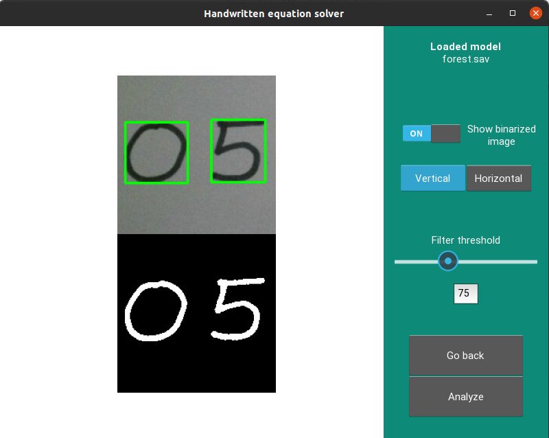
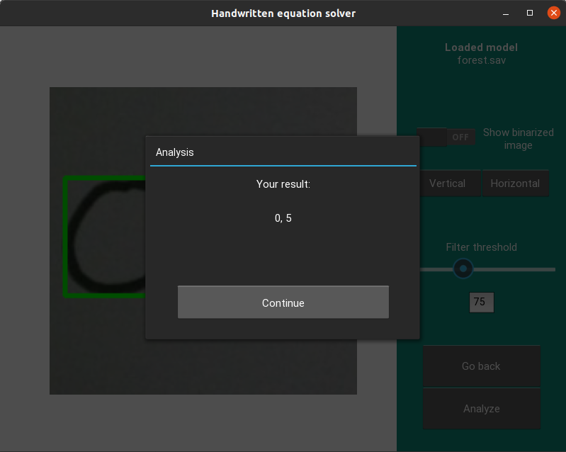

# Handwritten equation solver  

## App state
*The app is still under development*

At this state app can properly detect and recognize all handwritten numbers in a given photo.

## The algorithm

The result is achieved applying machine learning techniques for image analysis. This includes Random Forest and KNN classifiers using cosine metrics (~97% accuracy).
[Model training documentation](Training_doc.pdf)

Digit detection is implemented using image filtering and manipulation algorithms from OpenCV library.

## Screenshots

*Credit for GUI design: Klaudia Cofalka*

  Selecting the image | Filtering and detection
  -------------  | -------------
   | 

  **The Analysis**
  
  
  

  
